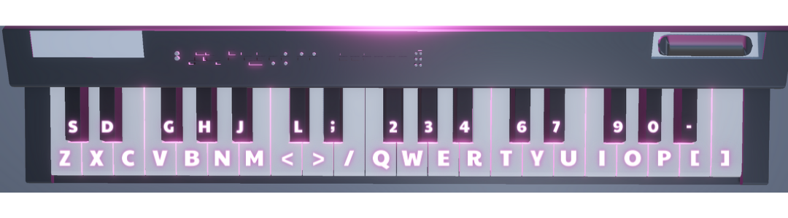

# 3DDEV_ADV_EXAM

## About
Piano learning game as part of 3DDEV_ADV course.

## How to use

Two types of piano layouts:
* Small
* Full

Controls for the small piano layout (QWERTY keyboard):

Controls for the full piano layout (MIDI):

📋 Will need to look into implementing ways to add a MIDI keyboard input, possible solutions:
* [Minis by Keijiro](https://github.com/keijiro/Minis)

## External assets used

📦 [Quick Outline by Chris Nolet](https://assetstore.unity.com/packages/tools/particles-effects/quick-outline-115488?aid=1101l9Bhe&utm_campaign=unity_affiliate&utm_medium=affiliate&utm_source=partnerize-linkmaker)